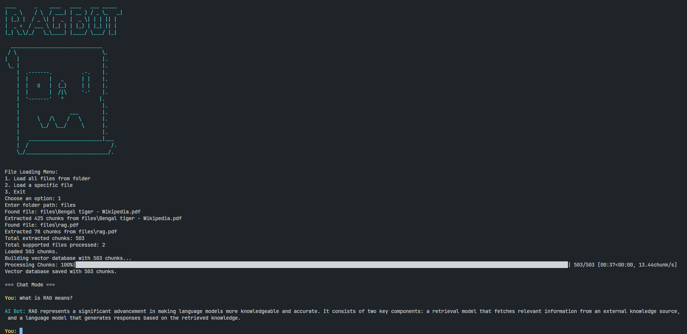

# 🤖 RAG BOT - Retrieval-Augmented Chatbot

RAG BOT is a simple, terminal-based Retrieval-Augmented Generation (RAG) chatbot. It extracts knowledge from your PDF, text, and image files and answers questions using that information only — no hallucinations!

---

## 🚀 Features

✅ Extracts text from **PDF**, **TXT**, and **image** files (with OCR)  
✅ Chunk-based text processing for better retrieval  
✅ FAISS vector database for fast similarity search  
✅ Supports continuous, chat-like interaction  
✅ Clean, colored terminal interface  
✅ File loader to easily load specific files or folders  
✅ Uses Ollama for embeddings and LLM generation  

---

## 📸 Screenshot



## 🗂️ Folder Structure

simpleRAG/
│
├── main.py # Main chat script
├── extractor.py # File extraction and chunking
├── vector_database.py # Vector DB management with FAISS
├── requirements.txt # Project dependencies
├── README.md # This file
├── files/ # Place your PDFs, TXT files, images here
└── vector.index # Auto-generated FAISS index after processing

---

## ⚒️ Requirements

- Python 3.9+  
- Ollama API working locally  
- Tesseract OCR installed (for image text extraction)  

---

## 🔧 Setup Instructions

1. **Clone the Project**

```bash
git clone <your_repo_link>
cd simpleRAG
Create Virtual Environment (Optional but Recommended)

```bash
Copy
Edit
python -m venv .venv
source .venv/bin/activate  # On Windows: .venv\Scripts\activate
Install Requirements

```bash
Copy
Edit
pip install -r requirements.txt
Install Tesseract OCR

Windows: Download from https://github.com/tesseract-ocr/tesseract

Linux: sudo apt install tesseract-ocr

Make sure pytesseract can find the tesseract binary. You may need to set the path inside extractor.py.

🗃️ How to Use
Place your files (PDFs, TXT, Images) inside the files/ folder or load files interactively.

Run the chatbot:

```bash
Copy
Edit
python main.py
Follow the prompts to load your files and start chatting!

Type exit to quit the chatbot.

💡 Example

File Loading Menu:
1. Load all files from folder
2. Load a specific file
3. Exit
After building the database, chat:

You: what is RAG?

AI Bot: RAG stands for Retrieval-Augmented Generation. It combines retrieval of relevant information with generative AI...
📦 Future Improvements
Incremental file addition

Better sentence-based chunking

Web-based chat UI (Streamlit)

PDF table/image extraction

❤️ Credits
Ollama for embedding and chat APIs

FAISS for vector search

PyMuPDF for PDF parsing

Tesseract OCR for image text extraction

yaml
Copy
Edit

---

# ✅ **requirements.txt**

```txt
tqdm
colorama
pytesseract
pillow
PyMuPDF
faiss-cpu
⚠️ If faiss-cpu fails to install directly, try:

bash
Copy
Edit
pip install faiss-cpu --index-url https://pypi.org/simple
